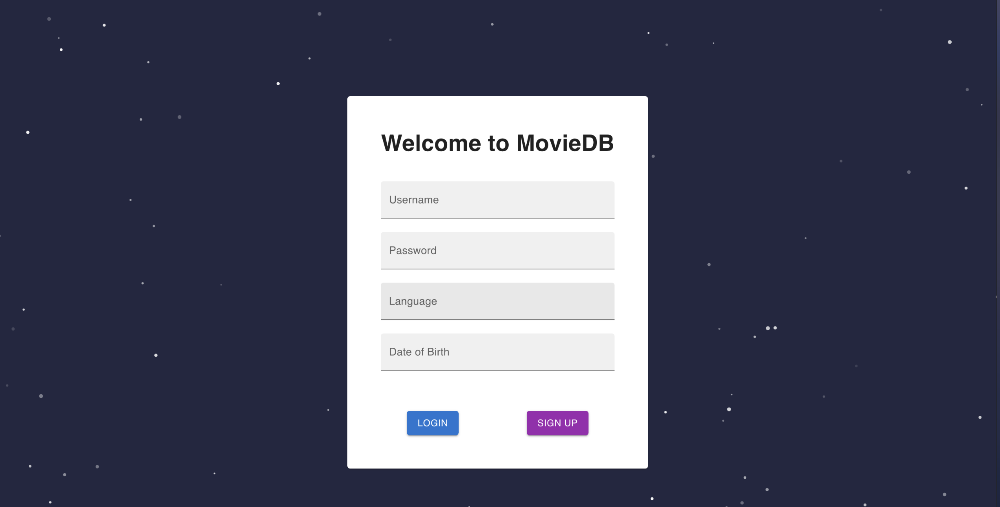
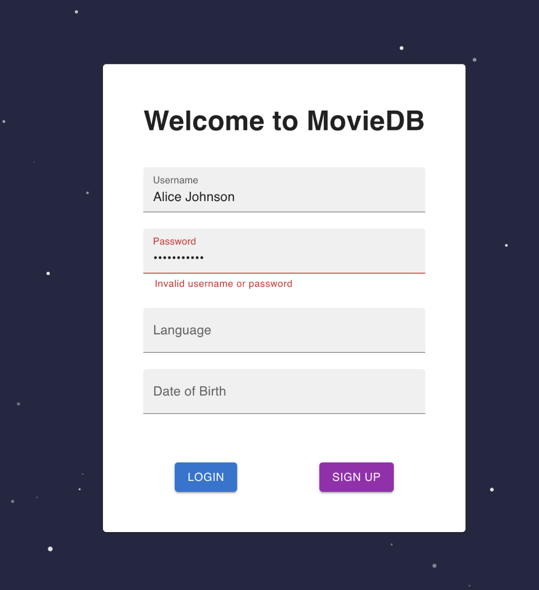
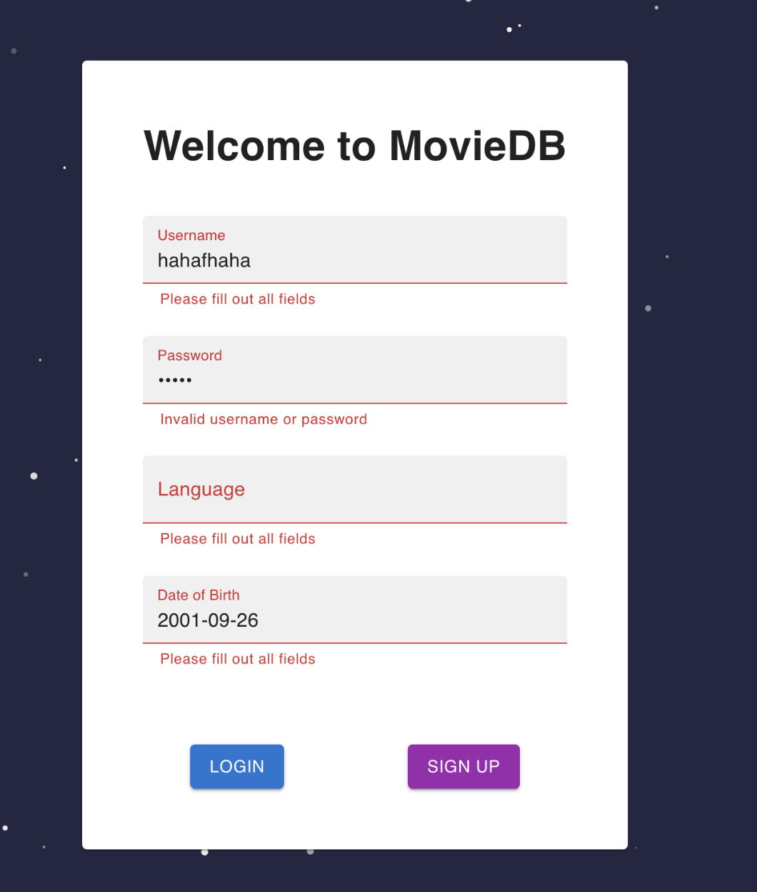
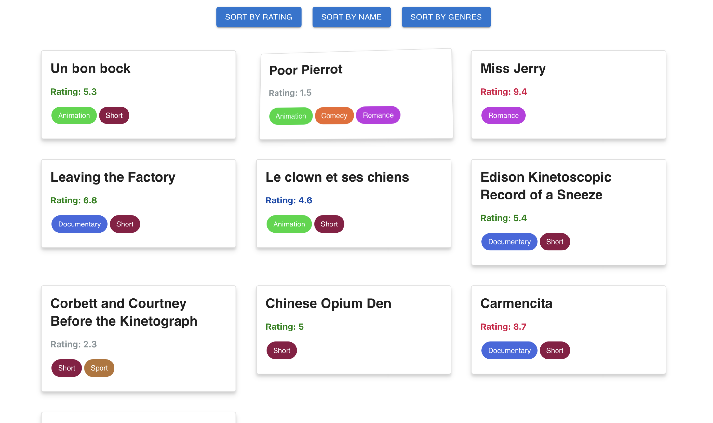
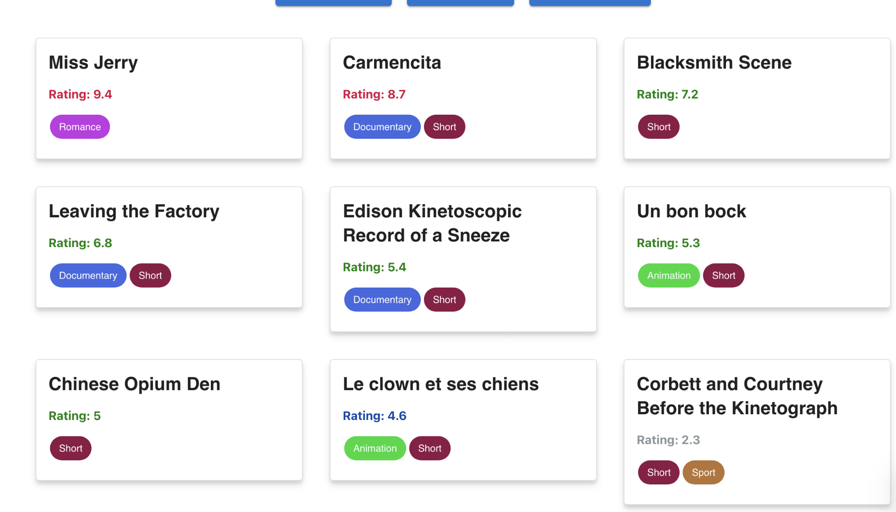
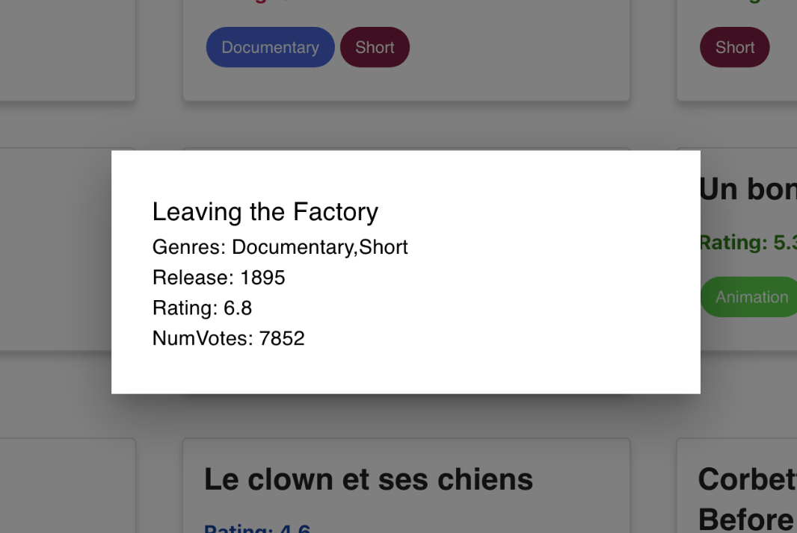

# Milestone 2

The link to the milestone 2 report can be found here: [report.pdf](https://docs.google.com/document/d/1B7Vtl7qic19OT3wTG5EU1CMJkK214ILyDAvyS6Z2oUo/edit?usp=sharing)

## Changes

- For this milstone, we decided to spin up a server with Go using gin, and moved our features into API endpoints.
- We have also introduced React for our GUI and frontend.

## Setup

- We have switched the database we use to **duckdb**, please make sure you have it installed.
- To setup the go environment, please ensure **go is installed** and run **`go mod download`**
- To be able to run our GUI, please ensure that the latest version of [node](https://nodejs.org/en/download) and [npm](https://docs.npmjs.com/downloading-and-installing-node-js-and-npm) are both installed.

## Running The App

- To start up the backend server, run `go run cmd/app/main.go` in the root directory.
- To start up the GUI, run `npm i` and `npm run dev` in the `/app` directory.
- note: running the application will automatically load the data.  

## Basic Features (Implemented via function calls)

Main features:  
R6: list_highest_rating_movie(db *sql.DB)  
    - finds the movie with the max rating.  
R9: list_highest_rating_movie_in_actor(db *sql.DB)  
    - finds the highest ranking movie which involved a specific actor.

note: the top level features directory contains the SQL queries and outputs for functions R6, R7, R8, R9.

## How to Generate Production Data:  
The data was sourced from [website](https://developer.imdb.com/non-commercial-datasets/) and the download link is [here.](https://datasets.imdbws.com/)  
Please download the listed files, unzip them using 'gunzip name.basics.tsv.gz title.basics.tsv.gz title.episode.tsv.gz title.principals.tsv.gz title.ratings.tsv.gz' on mac and replace the sample small data files with the production files in directory test-data.

## GUI

- Login Page implemented with user signup and signin functions, password & username verifications, and required field checks.

- The Movie Database page currently only supports display the movies and sorting them with a specific field. We can click into each movie card to checkout more details for the movie. More features are currently work in progress for the GUI to support the API calls.

Miscellaneous to be possibly used in the future, not part of milestone 1:
- The `list_movie_ratings` function created in the main file implements the feature where the users query all movies with their ratings.
- The `list_users` function created in the main file prints out all the users and their info.
