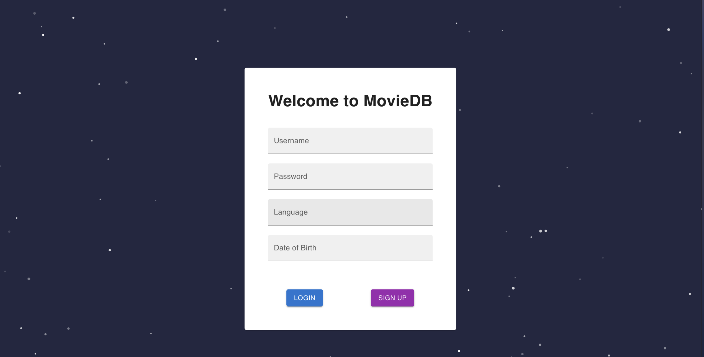
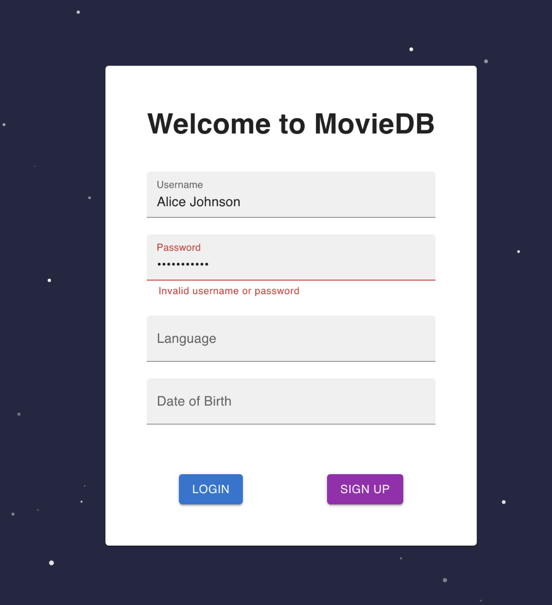
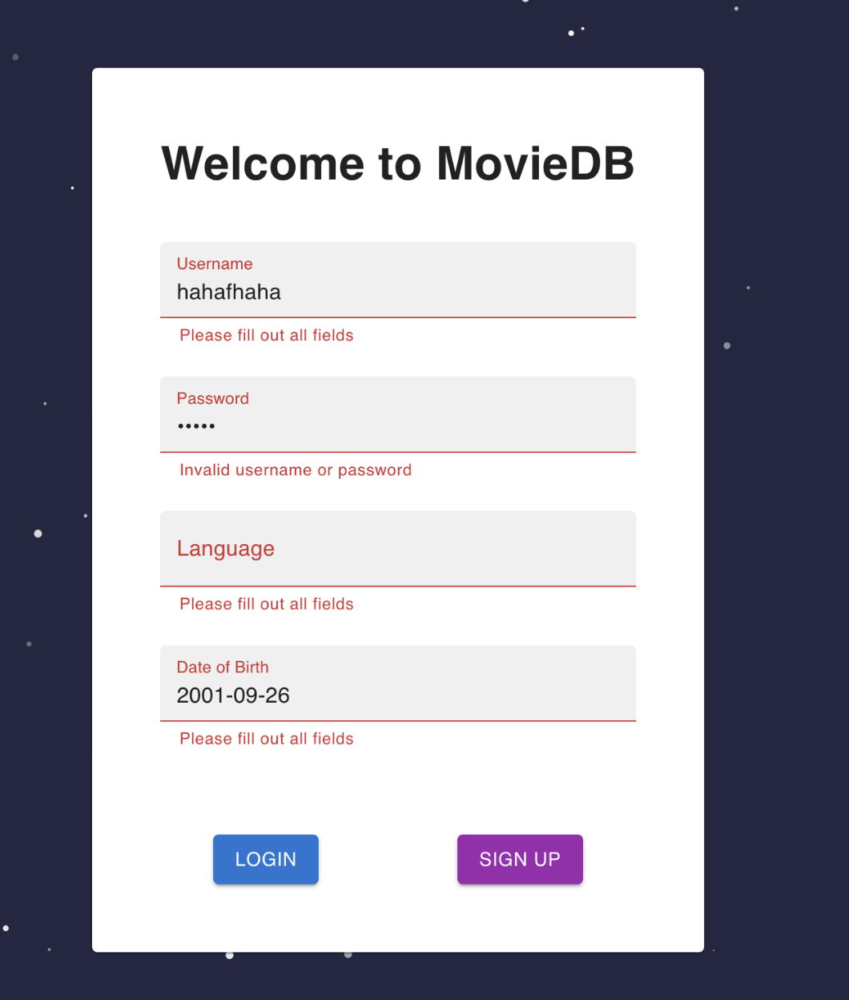
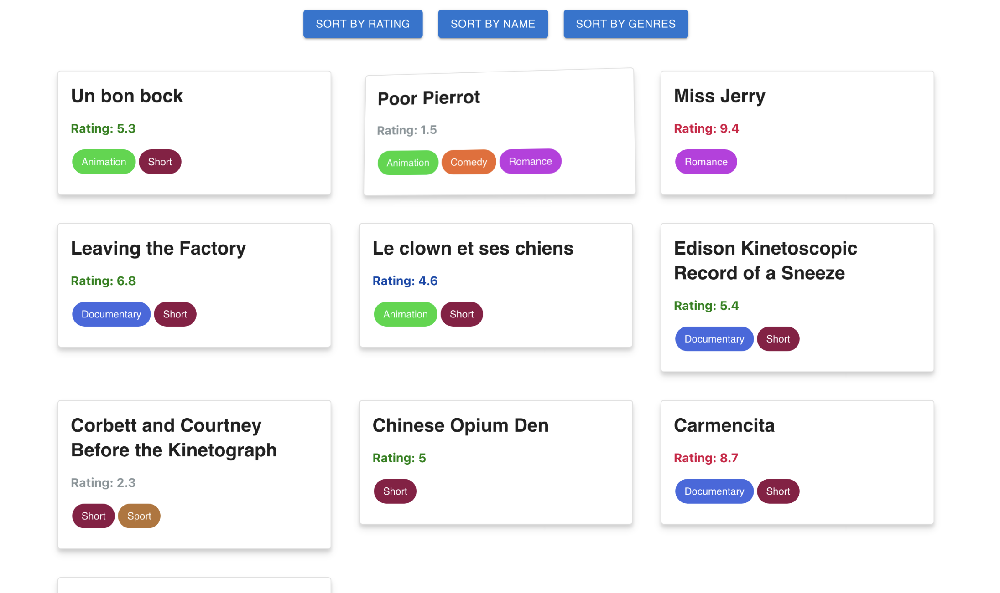
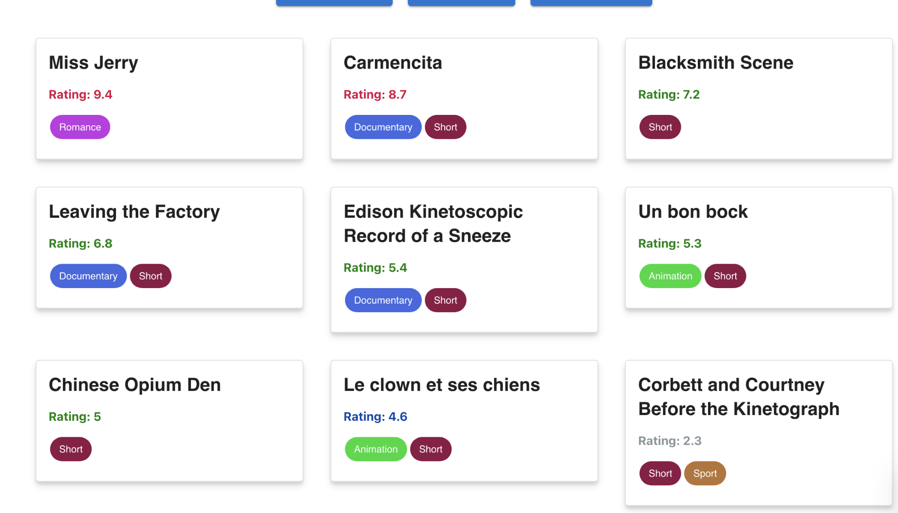
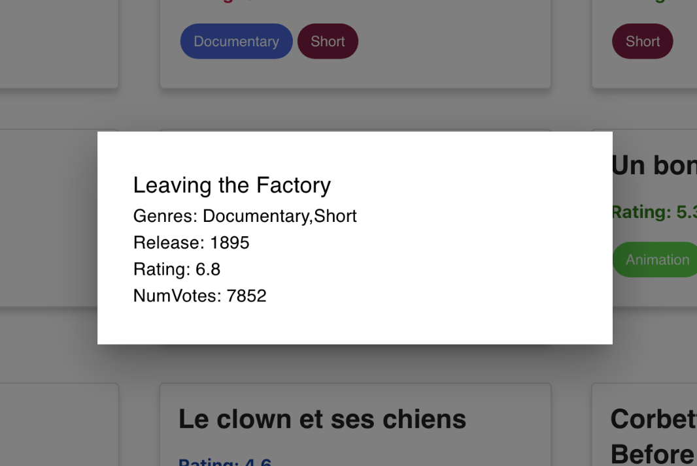

# Milestone 3

The link to the milestone 3 report can be found here: [report.pdf](https://docs.google.com/document/d/1EwoDG_Ouo9IDziAIWQ3MX6jzO2Qzc2nQ488OXFHSfkU/edit?usp=sharing)

## Setup

- We use the database **duckdb**, please make sure you have it installed.
- To setup the go environment, please ensure **go is installed** and run **`go mod download`**
- To be able to run our GUI, please ensure that the latest version of [node](https://nodejs.org/en/download) and [npm](https://docs.npmjs.com/downloading-and-installing-node-js-and-npm) are both installed.

## Running The App

- To start up the backend server, run `go run cmd/app/main.go` in the root directory.
- To start up the GUI, run `npm i` and `npm run dev` in the `/app` directory.
- note: running the application will automatically load the data.  

## How To Run The App With: Production Data and Sample Data
- In cmd/app/main.go there are two functions, initProdDb, and initTestDb,
  by default the database is loaded with the production database (the main function calls initProdDb), 
  to change to sample data just replace the call to initProdDb in main to initTestDb.  
- Create a bigData directory in the project repository  
- Run the Python file in the genData directory to generate user data  
- Download the [IMDB](https://developer.imdb.com/non-commercial-datasets/) movies dataset and place the files in the bigData directory  
- Execute the cmd/app/main.go file to load everything into the database (On the production dataset, this will take a few minutes)  

## Basic Features (Implemented via function calls)
note: the top level features directory contains the SQL queries and outputs for functions R6, R7, R8, R9, R10.
You can learn more about these features in the report. 

## GUI
- A quick preview of the GUI  

